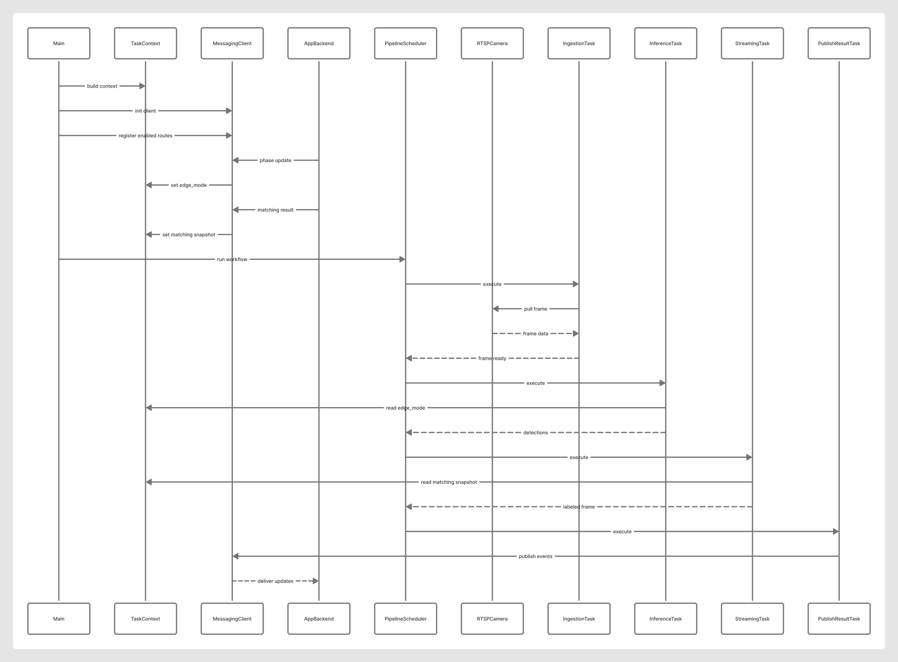
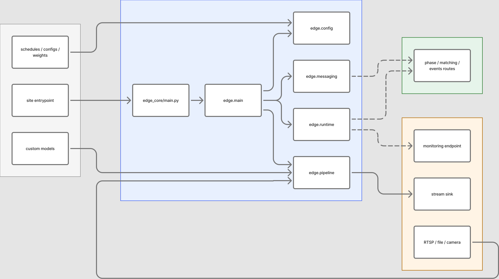
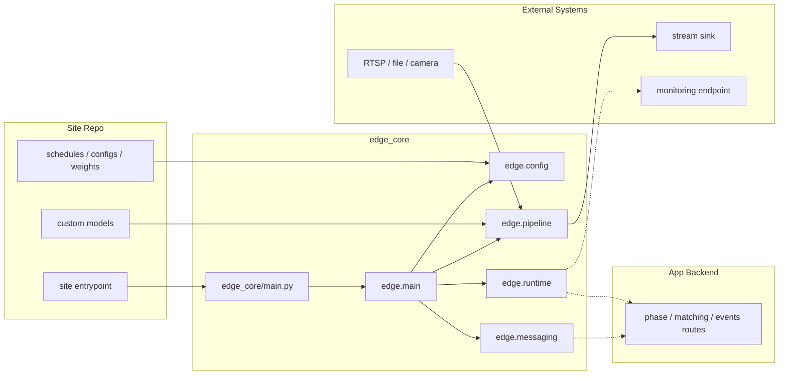
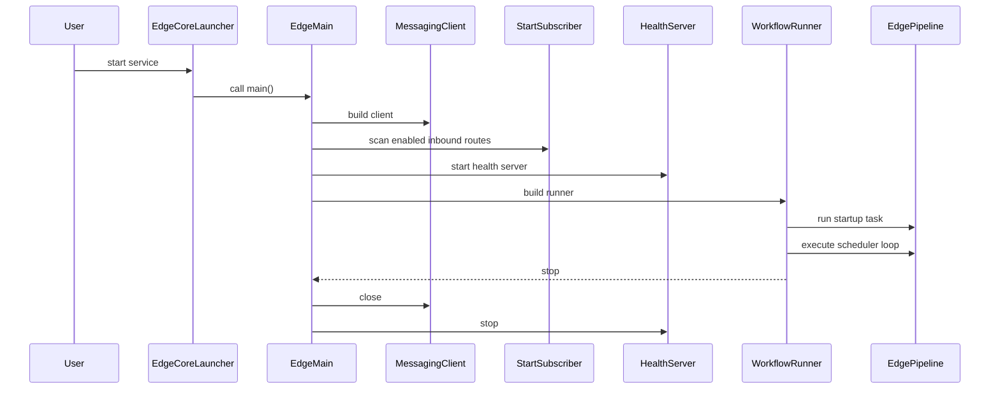
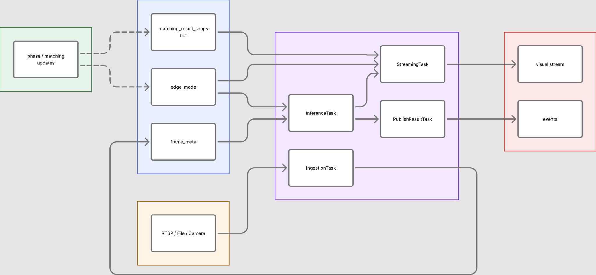
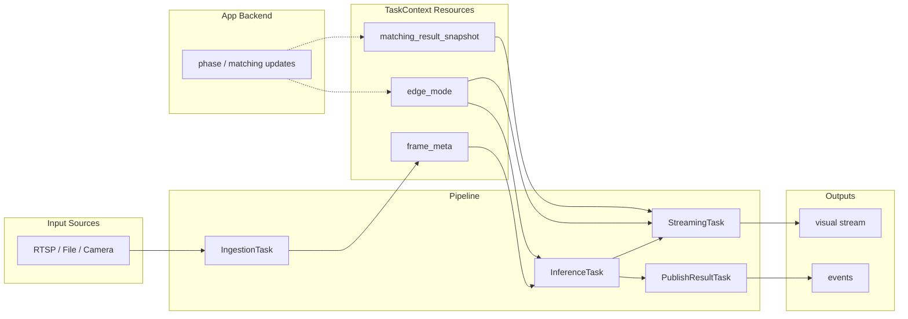
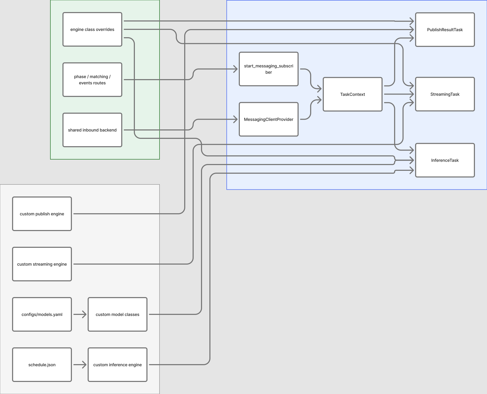
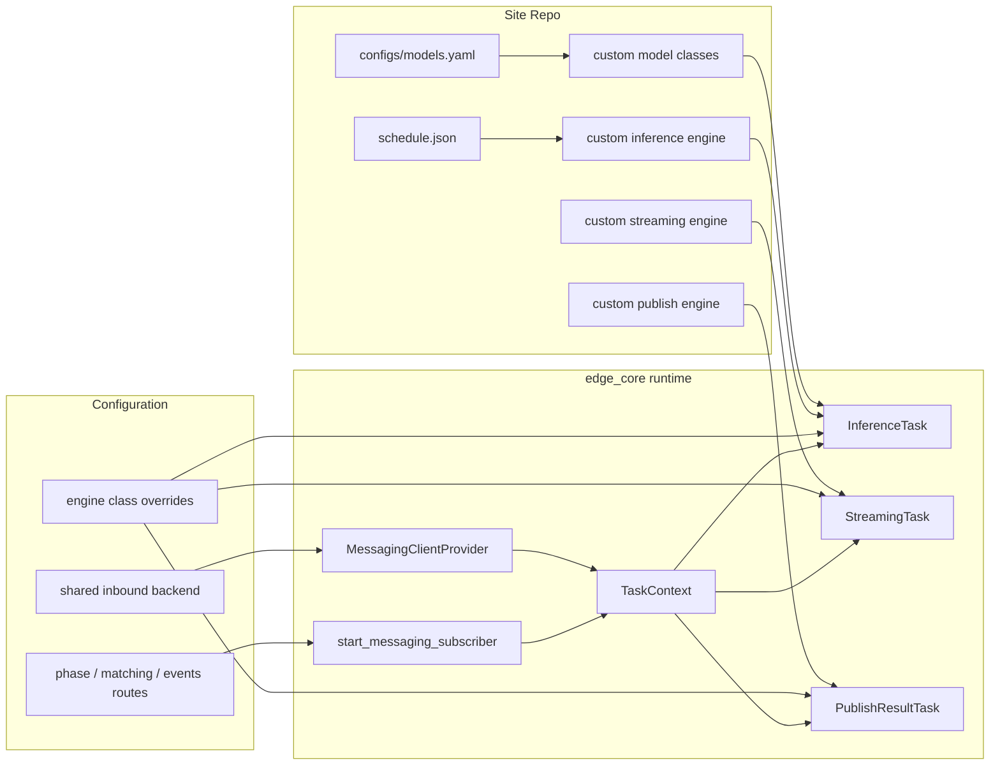
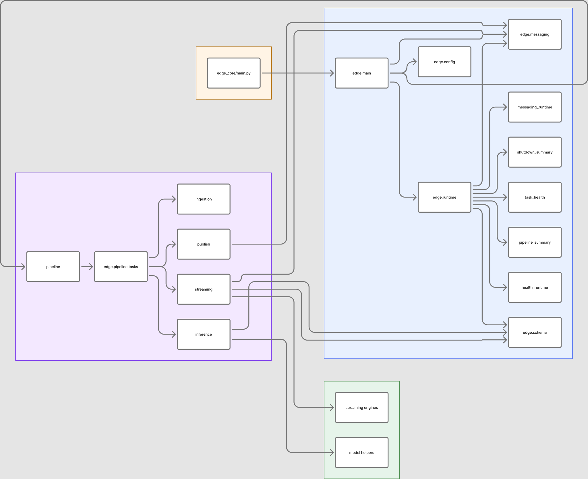
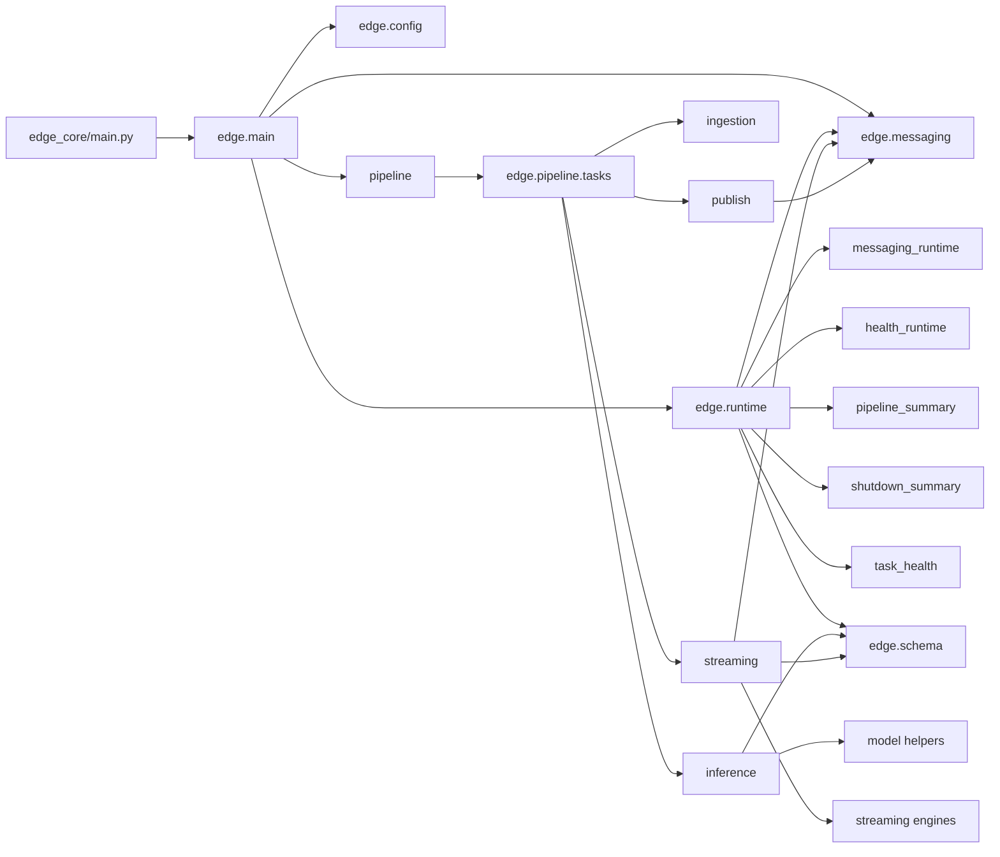

# edge_core 圖表總覽

這個目錄是 `edge_core` 圖表的單一來源。
設計順序是刻意排過的：先看專案邊界，再看啟動流程，接著看資料流與設定，最後才看模組依賴。

## Figma 匯出圖

以下 SVG 是從 Figma board 匯出的 runtime flow 視覺版，適合快速閱讀啟動、訂閱與 pipeline 的關係。
如果你只想先看 runtime 啟動鏈路，這張圖也可以直接對照下方第 2 節。

- SVG 原始檔：[`assets/edge-core-runtime-flow.svg`](assets/edge-core-runtime-flow.svg)
- 對應來源：Figma board 內的 `edge_core Runtime Flow`

## 圖表索引

| # | 圖表 | 說明 | 原始檔 |
|---|---|---|---|
| 1 | 專案邊界與角色 | 說明 `edge_core`、site repo、app backend 與外部系統之間的邊界 | [repository-overview.mmd](repository-overview.mmd) |
| 2 | Runtime 啟動與關閉 | 說明 launcher 如何交給 `edge.main`、workflow runner 與 runtime services | [runtime-bootstrap.mmd](runtime-bootstrap.mmd) |
| 3 | 核心 pipeline 與 context 流 | 說明 frame、`TaskContext` resource 與輸出如何在 pipeline 中流動 | [edge-core-pipeline.mmd](edge-core-pipeline.mmd) |
| 4 | 設定與擴充點 | 說明哪些設定會影響 runtime 行為，以及 site repo 可以替換哪些元件 | [configuration-and-extension-points.mmd](configuration-and-extension-points.mmd) |
| 5 | 模組依賴圖 | 說明內部套件與 runtime / pipeline / tasks / engines 之間的關係 | [module-dependency.mmd](module-dependency.mmd) |

## 1. 專案邊界與角色

這張圖說明 `edge_core` 的範圍、site repo 提供的擴充內容，以及它會接觸到的外部系統。

- Rendered view：本節
- Source：[`repository-overview.mmd`](repository-overview.mmd)
- Figma SVG：[`assets/edge-core-project-boundary.svg`](assets/edge-core-project-boundary.svg)

## 2. Runtime 啟動與關閉

這張圖說明 `edge_core/main.py` 如何進入 `edge.main`，以及 runtime 在啟動、訂閱、執行與關閉時的順序。

- Rendered view：本節
- Source：[`runtime-bootstrap.mmd`](runtime-bootstrap.mmd)
- Figma SVG：[`assets/edge-core-runtime-flow.svg`](assets/edge-core-runtime-flow.svg)

## 3. 核心 pipeline 與 context 流

這張圖說明 frame 從取流、推理到串流與事件發布的主路徑，同時標出 `edge_mode` 與 `matching_result_snapshot` 是怎麼進入 `TaskContext` 的。

- Rendered view：本節
- Source：[`edge-core-pipeline.mmd`](edge-core-pipeline.mmd)
- Figma SVG：[`assets/edge-core-pipeline-context.svg`](assets/edge-core-pipeline-context.svg)

## 4. 設定與擴充點

這張圖說明哪些設定控制 route wiring，哪些 site repo 元件可以替換或擴充 `edge_core` 的預設行為。

- Rendered view：本節
- Source：[`configuration-and-extension-points.mmd`](configuration-and-extension-points.mmd)
- Figma SVG：[`assets/edge-core-configuration-extensions.svg`](assets/edge-core-configuration-extensions.svg)

## 5. 模組依賴圖

這張圖說明 `edge_core` 內部模組之間的主要依賴關係，適合維護者快速定位 runtime、pipeline、tasks 與 engines 的連線方式。

- Rendered view：本節
- Source：[`module-dependency.mmd`](module-dependency.mmd)
- Figma SVG：[`assets/edge-core-module-dependencies.svg`](assets/edge-core-module-dependencies.svg)

## 備註

- 這份 README 是圖表入口，不是圖表內容的唯一來源。
- `.mmd` 檔維持原始 Mermaid source，SVG 則提供更精美的視覺預覽。
- 新圖表請先加到這個目錄，再更新 README 索引，這樣入口就能維持穩定。
