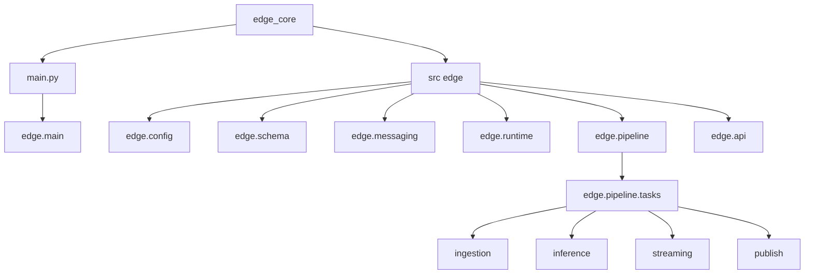
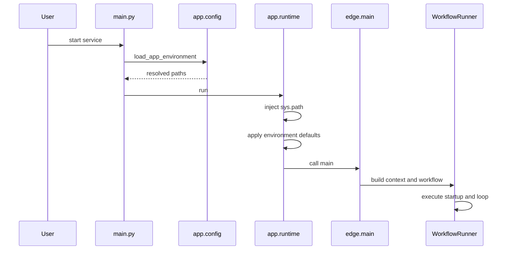
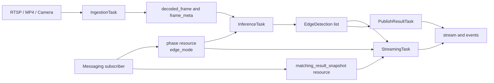
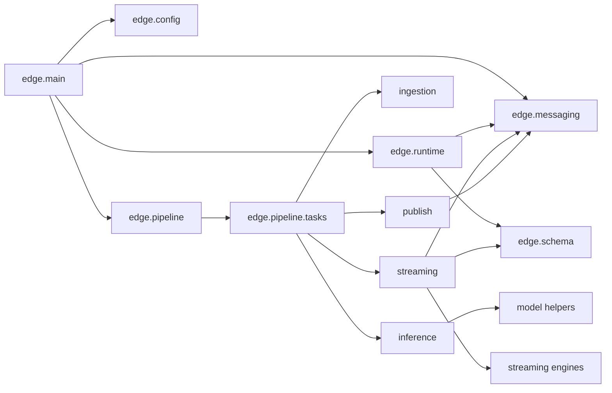

# Diagrams

This directory is the source of truth for `edge_core` diagrams.

## What is here

- A renderable Markdown page for each major diagram
- Raw `.mmd` source files for reuse and review

## Diagram Index

### 1. Repository Layout

Shows the `edge_core` package boundary, its main runtime entry, and the major internal modules.

- Rendered view: this section
- Source: [repository-overview.mmd](repository-overview.mmd)

### 2. Runtime Bootstrap

Shows how `edge_core/main.py` resolves configuration, injects paths, and hands off to `edge.main`.

- Rendered view: this section
- Source: [runtime-bootstrap.mmd](runtime-bootstrap.mmd)

### 3. Edge Pipeline

Shows the main frame-processing path from ingestion to publish, plus the inbound messaging subscriber that writes phase and matching snapshots into `TaskContext`.

- Rendered view: this section
- Source: [edge-core-pipeline.mmd](edge-core-pipeline.mmd)

### 4. Core Module Dependencies

Shows the main internal dependencies and how the runtime, pipeline, tasks, and engines connect.

- Rendered view: this section
- Source: [module-dependency.mmd](module-dependency.mmd)

## Notes

- Keep the Markdown page and the `.mmd` source files in sync.
- Add new diagrams here first so the README only needs one stable link.
